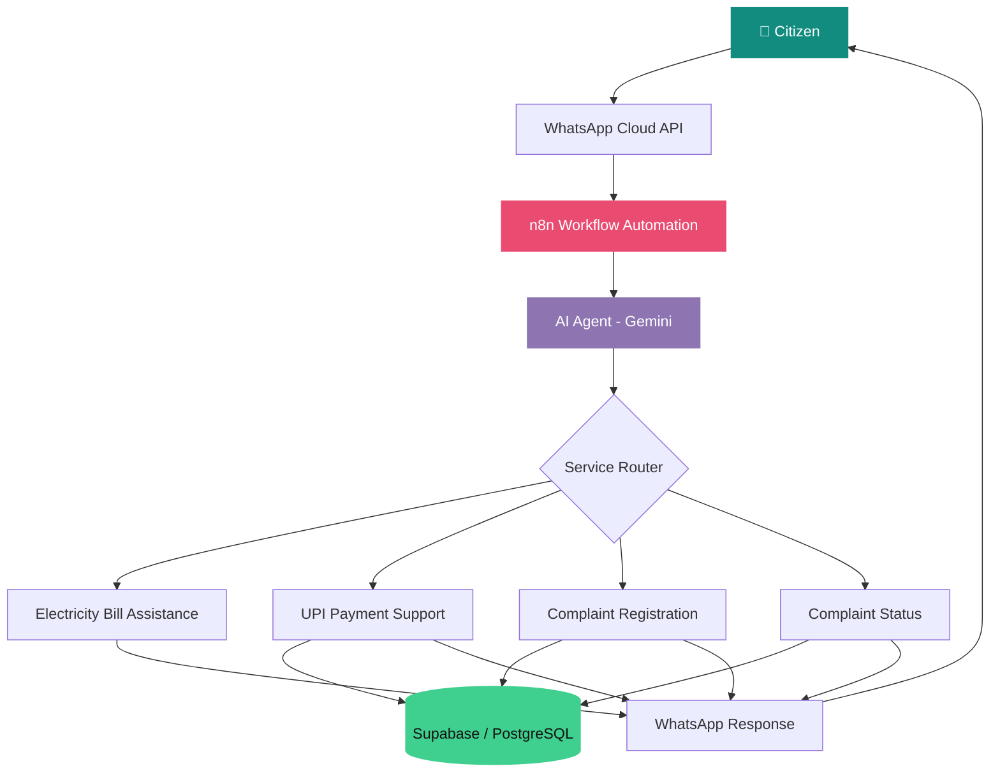

# ⚡ Smart Electricity AI

### AI-Powered Electricity Service Automation System

An intelligent, multilingual WhatsApp assistant that simplifies electricity services through AI, workflow automation, and database integration.

 

 

**Smart Support • Automated Complaints • Multilingual AI**

---

## 🌟 About the Project

**Smart Electricity AI** is an AI-powered citizen-support solution designed to simplify electricity-related services through WhatsApp.

Built using n8n, Google Gemini AI, WhatsApp Cloud API, and Supabase, the system helps consumers access electricity bill guidance, resolve digital payment-related queries, register complaints, and check complaint status.

The platform supports Tamil, English, and Tanglish, making electricity services more accessible and convenient for citizens.

The project focuses on reducing repetitive manual support tasks through intelligent automation, secure data handling, and database-driven operations.

---

## ✨ Key Features

<table>
<tr>
<td width="50%">

### 🤖 AI-Powered Support
- Automated WhatsApp conversations
- Intelligent query understanding
- Context-aware responses

</td>
<td width="50%">

### ⚡ Electricity Services
- Bill download and printing guidance
- Online payment assistance
- Electricity bill estimation

</td>
</tr>
<tr>
<td width="50%">

### 📝 Complaint Management
- UPI payment complaint registration
- Database-backed complaint storage
- Complaint status tracking

</td>
<td width="50%">

### 🌐 Multilingual AI
- Tamil language support
- English language support
- Tanglish conversation support
- Audio and video message understanding

</td>
</tr>
</table>

### 🔐 Security & Reliability

- Never requests OTP, UPI PIN, CVV, or banking passwords.
- Does not invent payment confirmations or complaint statuses.
- Uses database records for complaint-related operations.
- Guides users to official electricity department portals for sensitive transactions.

---

## 🏗️ System Architecture

---

## 🛠️ Tech Stack

| Technology | Purpose |
|---|---|
| n8n | Workflow automation and orchestration |
| Google Gemini AI | Natural language understanding and AI responses |
| WhatsApp Cloud API | Citizen communication |
| Supabase | Cloud database and complaint storage |
| PostgreSQL | Structured data management |
| JavaScript | Data transformation and workflow logic |
| REST APIs | Service integration and communication |
| Webhooks | Real-time message handling |

---

## 🔄 How It Works

1. **Message Reception:** A citizen sends a text, audio, or supported video message through WhatsApp.
2. **Workflow Processing:** n8n receives and routes the incoming message.
3. **AI Understanding:** Gemini AI interprets the user's request and identifies the relevant service.
4. **Service Execution:** The workflow provides guidance or performs supported database operations.
5. **Database Integration:** Complaint details are stored in Supabase, and complaint status is retrieved from existing records.
6. **Automated Response:** The system sends the relevant response back to the citizen through WhatsApp.

---

## 💡 Problem Statement

Electricity consumers may face difficulties navigating online bill services, resolving UPI payment issues, registering complaints, and tracking service requests.

This project addresses these challenges by providing a centralized, multilingual WhatsApp interface that simplifies access to electricity services and automates complaint-related workflows.

### Project Objectives

- Improve accessibility to electricity department services.
- Reduce repetitive manual support tasks.
- Simplify payment complaint registration and tracking.
- Provide multilingual citizen assistance.
- Enable future integration with websites and mobile applications.

---

## 🔮 Future Enhancements

- Integration with official electricity department APIs for verified payment and consumer data.
- Automated AI-model fallback and retry handling.
- Administrative dashboard for complaint monitoring and analytics.
- Enhanced Tamil speech recognition.
- Integration with mobile applications and government service portals.
- Production deployment with secure authentication and monitoring.

---

## 🎯 Project Goal

To build a scalable, secure, and multilingual AI-powered citizen-support platform that connects WhatsApp, artificial intelligence, workflow automation, and database services to make electricity-related services easier to access.

---

## 👨‍💻 Developer

**Poovarasu S**

B.Tech Computer Science and Engineering

Interested in AI Automation, Integration Development, and Digital Transformation.

### ⚡ Making Electricity Services Smarter with AI

*AI • Automation • Integration • Citizen Services*

